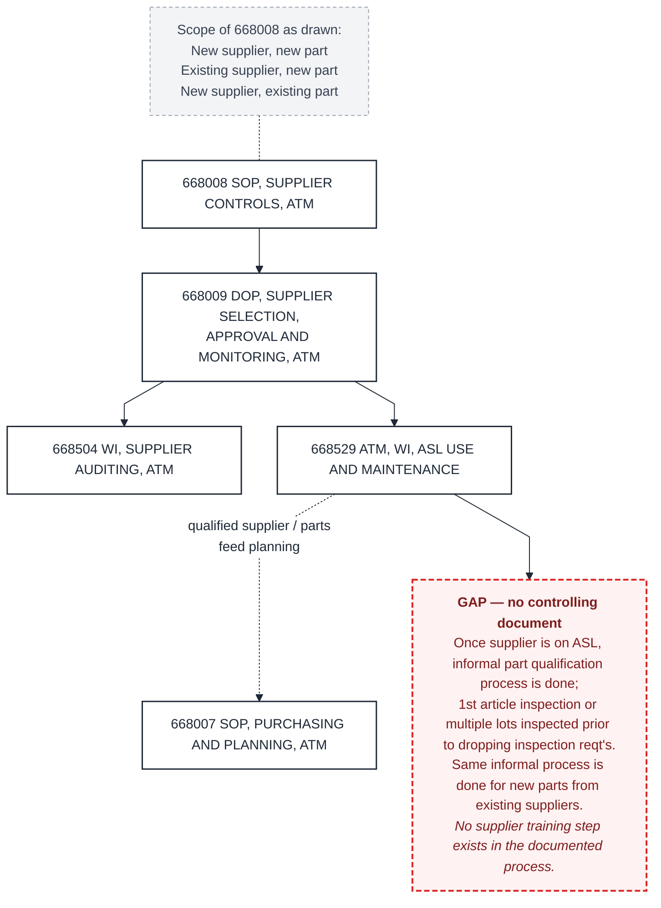
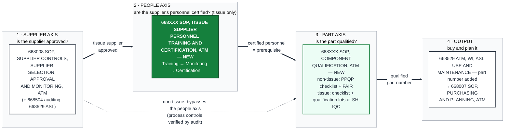
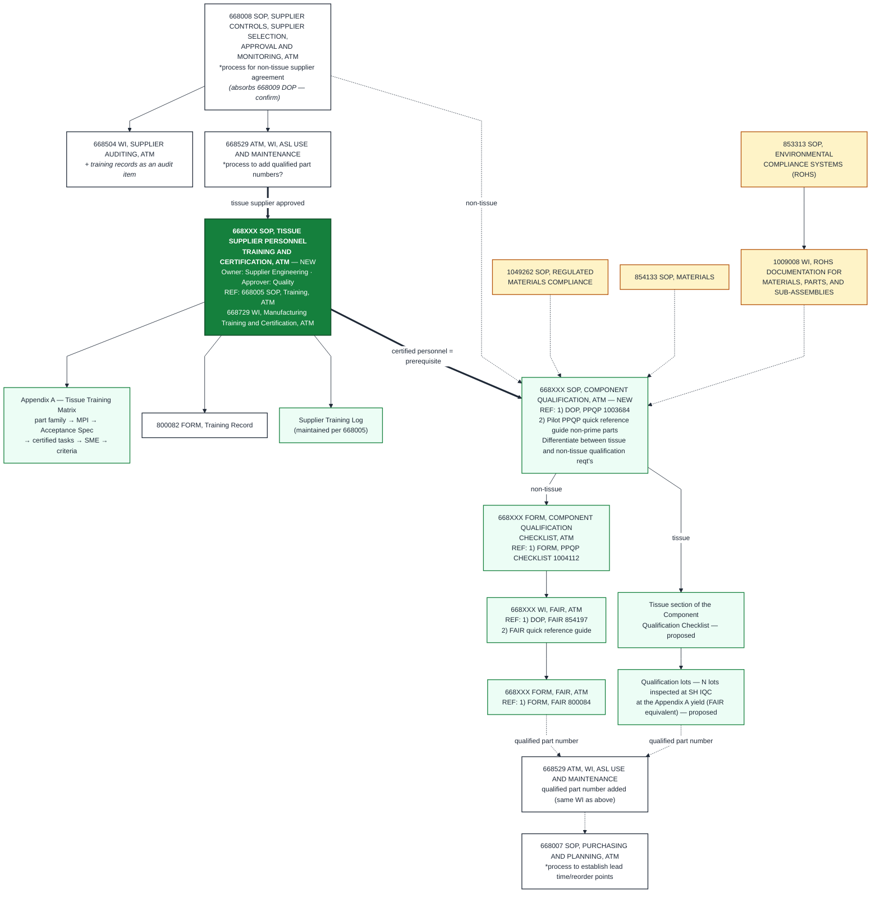
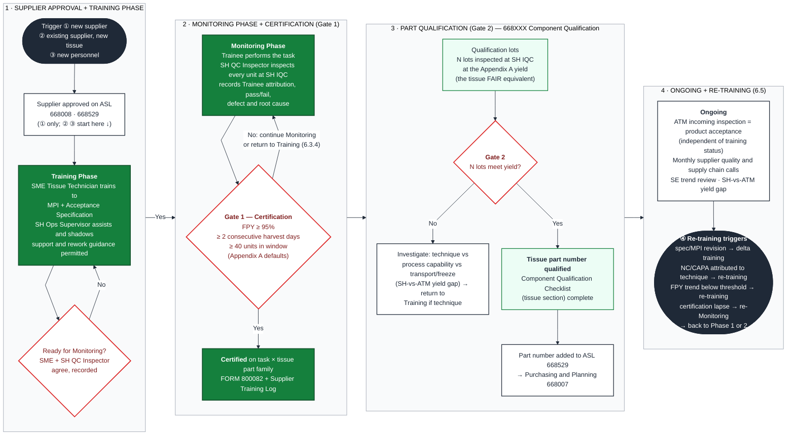
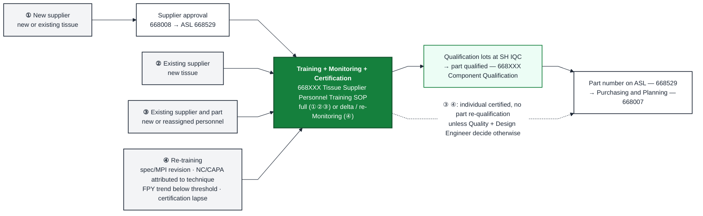
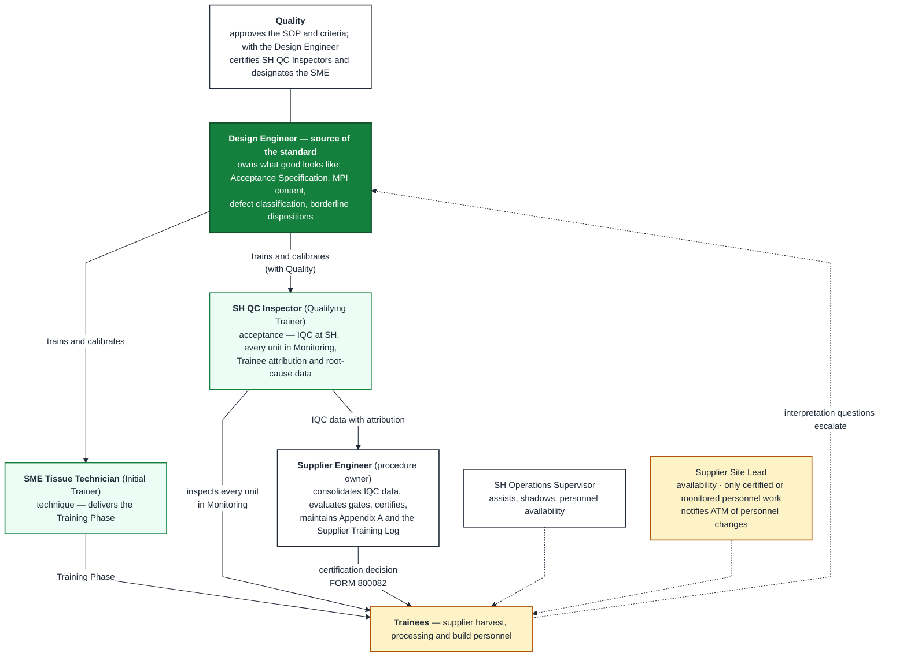

# ATM Part Qualification and Tissue Supplier Training — Working Handoff

**Version 1 · 2026-09-16 · Status: working draft for cross-agent review**
Prepared by Claude (Cowork session) with Oscar Penny, Supplier Engineer, Intuitive Surgical — Advanced Tissue Models (ATM).
Sessions covered: 2026-09-09 and 2026-09-16.

---

## 0. How to use this document

### 0.1 Purpose

This package brings a second AI agent fully up to speed on a process-design task so it can revise and challenge the work. The task has two workstreams:

1. **Process design** — define a formal parts (component) qualification process for ATM and place a *tissue supplier personnel training* step inside it. Deliverable: redrawn process maps (Oscar wants an editable PowerPoint; not built yet — see §11).
2. **Document review** — review Oscar's draft training procedure section by section and generalize it from pelvic blocks to any tissue. Deliverable: a redlined copy of the draft (not built yet; sections 1–5 have proposed rewrites, section 6 has findings, section 7 is not yet reviewed).

The reviewing agent's output comes back to Oscar, who relays it to Claude for reconciliation. Both agents are expected to work back and forth through Oscar.

### 0.2 Provenance tags

Every substantive statement carries one of these tags so the reviewer knows what can be challenged:

- **[O]** — stated or decided by Oscar. Locked unless the reviewer identifies a material risk (state the risk explicitly).
- **[D]** — content of Oscar's draft document *668XXX_Pelvic_Block_Supplier_Training_DRAFT_OP_060426.docx*.
- **[M]** — content of Oscar's two original process maps (transcribed in §2.1–2.2; verbatim labels in Appendix A).
- **[C]** — Claude's proposal or analysis. Fully open to challenge.
- **[?]** — open item; input needed from Oscar or a decision not yet made.

### 0.3 Review protocol for the reviewing agent

1. Return findings as a numbered list keyed to this document's section IDs (e.g., `F-07 · §10.2 / 2.3`).
2. Classify each finding: `CHALLENGE` (disagrees with a [C] proposal), `RISK` (disagrees with an [O] decision — state the concrete risk), `GAP` (something missing), `WORDING` (text only), `ASK-OSCAR` (a question only Oscar can answer).
3. For wording changes, supply replacement text as a block, not commentary. For diagram changes, supply the complete replacement Mermaid source for that figure (sources are in Appendix B).
4. Do **not** rename, paraphrase, or renumber any document label Oscar supplied (Appendix A). Keep `668XXX` placeholders as they are. Oscar wants his exact labels preserved.
5. Do not relitigate [O] decisions without a stated risk. Do not invent document numbers, part numbers, or regulatory citations — mark unknowns as `[?]`.
6. Prefer the fewest questions with the highest leverage; Oscar's time is the constraint. Batch questions.

### 0.4 File set

| File | For | Contents |
|---|---|---|
| `ATM_Tissue_Qualification_Training_Handoff_v1.md` | AI agents | This document, with figures as image links and Mermaid sources in Appendix B |
| `ATM_Tissue_Qualification_Training_Handoff_v1.docx` / `.pdf` | Humans | Same content, figures embedded (landscape pages; zoom for detail) |
| `diagrams/*.png` | Both | Rendered figures at 2× resolution |
| `diagrams/*.mmd` | AI agents | Editable Mermaid sources |
| `668XXX_Pelvic_Block_Supplier_Training_DRAFT_OP_060426.docx` | Both | Oscar's original draft (supplied separately by Oscar) |

---

## 1. Context

- **Who.** Oscar Penny is a Supplier Engineer in ATM (Advanced Tissue Models), a division of Intuitive Surgical in Durham, NC. He manages the Approved Supplier List (ASL), supplier onboarding and risk categorization, supplier audits, FAIR processes, and regulatory compliance for animal-origin materials. [O]
- **What ATM buys.** Three part categories: tissue products, non-tissue complex parts, non-tissue simple parts. [O] Tissue products are harvested at supplier sites (slaughterhouses today; possibly processors in future) by supplier personnel, to an ATM Manufacturing Process Instruction (MPI) and acceptance specification. ATM stations QC inspectors at the slaughterhouse ("IQC at SH") to inspect at the point of harvest. [D]
- **Why this matters.** Tissue quality is made by people performing a manual harvest. The January 2026 pelvic block rejection crisis at one supplier (peak 96.7% rejection) was traced to harvest technique and communication gaps; the corrective action (CAPA 2026-01) was training-only. [O, prior sessions] The draft training procedure grew out of that.
- **Regulatory background (context only, not part of this design).** FSIS, not APHIS, governs intrastate movement of undenatured inedible porcine tissue; 9 CFR 325.11 permit and labeling requirements apply to transport. [O, prior sessions]
- **The problem.** ATM's documented supplier controls stop at "supplier approved on the ASL." Part qualification is informal (§3). There is no documented supplier training step. Oscar is creating (a) a formal Component Qualification SOP and (b) a tissue supplier training procedure that must apply to **any** new tissue, not just pelvic blocks, and he wants the process map to show exactly where training happens. [O]

---

## 2. Inputs received

### 2.1 Map A — "Current ATM Supplier Controls and Part Qualification" [M]

Transcribed (labels verbatim, see Appendix A):

- Scope labels beside the top SOP: *New supplier, new part · Existing supplier, new part · New supplier, existing part*
- `668008 SOP, SUPPLIER CONTROLS, ATM` → `668009 DOP, SUPPLIER SELECTION, APPROVAL AND MONITORING, ATM`
- `668009` → `668504 WI, SUPPLIER AUDITING, ATM` and → `668529 ATM, WI, ASL USE AND MAINTENANCE`
- `668529` ⇢ (dashed) `668007 SOP, PURCHASING AND PLANNING, ATM`
- Note under `668529`: *"Once supplier is on ASL, informal part qualification process is done; 1st article inspection or multiple lots inspected prior to dropping inspection reqt's. Same informal process is done for new parts from existing suppliers"*

### 2.2 Map B — proposed "…Qualification Structure" (title partially cut off in the screenshot) [M]

- `668007 SOP, PURCHASING AND PLANNING, ATM` — *\*process to establish lead time/reorder points*
- `668008 SOP, SUPPLIER CONTROLS, SUPPLIER SELECTION, APPROVAL AND MONITORING, ATM` — *\*process for non-tissue supplier agreement*. Scope labels: *New supplier, new part · New supplier, existing part*. (The 668009 DOP title has been merged into 668008 — whether the DOP is retired is unconfirmed [?].)
  - → `668504 WI, SUPPLIER AUDITING, ATM`
  - → `668529 ATM, WI, ASL USE AND MAINTENANCE` — *\*process to add qualified part numbers?*
- `668XXX SOP, COMPONENT QUALIFICATION, ATM` — NEW. Scope labels: *New supplier, new part · Existing supplier, new part*. *REF: 1) DOP, PPQP 1003684 2) Pilot PPQP quick reference guide non-prime parts*. Note: *Differentiate between tissue and non-tissue qualification reqt's*
  - → `668XXX FORM, COMPONENT QUALIFICATION CHECKLIST, ATM` — *REF: 1) FORM, PPQP CHECKLIST 1004112*
  - → `668XXX WI, FAIR, ATM` — *REF: 1) DOP, FAIR 854197 2) FAIR quick reference guide* → `668XXX FORM, FAIR, ATM` — *REF: 1) FORM, FAIR 800084*
  - Dashed inputs from corporate documents: `1049262 SOP, REGULATED MATERIALS COMPLIANCE`, `854133 SOP, MATERIALS`, `853313 SOP, ENVIRONMENTAL COMPLIANCE SYSTEMS (ROHS)` → `1009008 WI, ROHS DOCUMENTATION FOR MATERIALS, PARTS, AND SUB-ASSEMBLIES`
- Dashed outputs: `668529` and the Component Qualification Checklist both feed back to `668007`.
- Three green notes at the top are cut off in the screenshot. Visible fragments: *"…number)"* and *"…requires FAIR (how to identify changes/new parts etc."* — content needed from Oscar [?].

### 2.3 The training draft [D]

*668XXX_Pelvic_Block_Supplier_Training_DRAFT_OP_060426.docx* — "Pelvic Block Supplier Personnel Training" — Owner: SH Operations Supervisor · Prepared and designed by: Supplier Engineer. Draft dated 06/04/26, marked DRAFT — FOR REVIEW.

Structure: 1 Purpose · 2 Scope · 3 References · 4 Definitions/Acronyms · 5 Responsibilities · 6 Procedure (6.1 General, 6.2 Training Phase, 6.3 Monitoring Phase, 6.4 Certification, 6.5 Ongoing Feedback, 6.6 Records) · 7 Process Flow (swimlane figure) · Remaining Open Items.

Mechanics as drafted:

- Modeled on `668729 WI, Manufacturing Training & Certification, ATM` under `668005 SOP, Training, ATM`, adapted to a supplier site: the 668729 Mentoring Phase is replaced by a Monitoring Phase; no Mentor role at the supplier site.
- Course material: `MPI 1176680` (pelvic block process instruction) and "Specs and WI — Pelvic Harvest" cited as `666541, 666506`.
- **Training Phase** (SME Harvesting Tech delivers; SH Operations Supervisor assists/shadows; support permitted) → **Monitoring Phase** (Trainee performs; SH QC Inspector inspects every build at SH IQC; peer questions allowed) → **Certification** when First Pass Yield ≥ 95% over ≥ 2 consecutive working days (SE evaluates; recorded on `FORM 800082, Training Record` and a Smartsheet Supplier Training Log) → **Ongoing feedback** via monthly supplier quality and supply chain calls and SE trend review.
- QC inspection techs are certified by attribute agreement against a reference set, not by FPY (6.4.3, criteria proposed: ≥ 90% agreement, zero missed safety-critical defects).
- 6.1.3 principle: *IQC at SH for qualification and feedback; ATM incoming inspection for final product acceptance* — all blocks remain subject to the independent ATM inspection regardless of training status.
- The draft's own open items: (1) sample-size floor for the 95% gate (proposed ≥ 20 units per Monitoring day or ≥ 40 across the 2-day window); (2) parts where 95% FPY has not been demonstrated achievable (options a/b/c); (3) QC-inspector agreement criteria; (4) Quality's ongoing owner for SH QC inspector training; (5) records ownership and Smartsheet setup.
- Defects found in the draft during review [C]: 6.5.3 references a clause "6.3.4" that does not exist; 6.4.1 certifies only "Female Pelvics Harvesting"; "Supplier Engineer data" typo in the Certification definition; Training Department "owns records" (§4) vs. SH Operations Supervisor owns 800082 archival with system ownership TBD (6.6.2).

### 2.4 Decision log — Oscar's answers, in order [O]

| # | Question put to Oscar | Oscar's answer (verbatim where short) |
|---|---|---|
| 1 | Where does supplier training fall in the qualification process? | "I believe this training should be in between these two processes" — i.e., between 668008 (supplier approved) and 668XXX Component Qualification (part qualified). |
| 2 | Document level of the training step? | Own SOP, peer of 668008 and 668XXX. |
| 3 | What counts as a tissue part being qualified (the FAIR equivalent)? | "It's number 1 [personnel certification + N lots], but this inspections should happen at the Slaughter houses." |
| 4 | Which events route through training? | All four: new supplier (new or existing tissue); existing supplier, new tissue; existing supplier/part, new personnel; re-training (spec/MPI change, NC/CAPA, FPY trend). |
| 5 | Format for the redrawn maps? | Editable PowerPoint. |
| 6 | Sequence? | Review the document first, deck after; all sections (1–7) in scope. |
| 7 | Who certifies the QC inspection techs at the slaughterhouse? | "QC department at ATM and Design Engineer." |
| 8 | Procedure owner now that it is a peer SOP? | Supplier Engineering owns, Quality approves. |
| 9 | "SH" vocabulary for non-slaughterhouse suppliers? | Keep SH, define it as the umbrella term for any tissue supplier site. |
| 10 | Can SH IQC attribute each unit to the individual who harvested/built it today? | "No — needs to be set up." |
| 11 | Define a "Certified Supplier Trainer" role (supplier employee who delivers training)? | "There is no role currently, this is an alignment between quality and design engineer." |
| 12 | (Unprompted) | "Design Engineer is the ultimate owner of what good looks like in a tissue; IQC inspector and harvesting technician acquire this knowledge ultimately from this source." |

---

## 3. Current state (as-is)

*Figure 1 — Current state. Source: Appendix B.1.*

Reading [C]: the documented chain answers one question only — *is the supplier approved?* Part qualification lives nowhere; it is an informal step tucked under ASL maintenance ("1st article inspection or multiple lots inspected prior to dropping inspection reqt's"). No document owns "is this part qualified?", and no document mentions training supplier personnel. For non-tissue parts the informal step is roughly a FAIR; for tissue it is roughly "inspect a few lots" — with no definition of how many, at what yield, or by whom.

---

## 4. Where supplier training sits — the three-axis model

### 4.1 Placement [O + C]

Oscar's decision: training is its own SOP sitting **between** 668008 and 668XXX Component Qualification. Claude's framing of why that is the right structure:

| Axis | Question answered | Document | Applies to |
|---|---|---|---|
| 1 · Supplier | Is the supplier approved? | 668008 (with 668504 auditing, 668529 ASL) | all suppliers |
| 2 · People | Are the supplier's personnel certified on our process? | **668XXX SOP, Tissue Supplier Personnel Training and Certification, ATM** (new; title proposed [C]) | tissue suppliers |
| 3 · Part | Is the part qualified? | 668XXX SOP, Component Qualification, ATM (new) | all parts |
| 4 · Output | Buy and plan it | 668529 (part number added) → 668007 | all parts |

Rationale [C]: for a machined part the requirement lives in a drawing and qualification is verified by measuring a part (FAIR). For a harvested tissue the requirement lives in an MPI plus an acceptance specification, and the "part" is the output of a manual process performed by named people at the supplier. Qualifying the part therefore means qualifying the process, which means (a) certifying the people who perform it and (b) verifying the output over a stream of lots. The Monitoring Phase FPY gate in Oscar's draft *is* the tissue first article, measured as a yield across units rather than one part against a drawing. For non-tissue parts the people axis collapses to "the supplier's own process controls," verified by audit under 668504, and the part goes straight from supplier approval to Component Qualification.

*Figure 2 — Placement of the training SOP. Source: Appendix B.2.*

### 4.2 Proposed document hierarchy (to-be)

*Figure 3 — Proposed document hierarchy. White = existing ATM document; light green = new ATM document; solid green = the training SOP being placed; amber = corporate reference document (as drawn by Oscar). Source: Appendix B.3.*

Notes on Figure 3 [C]:

- Everything Oscar drew under Component Qualification (PPQP checklist, FAIR WI and form, RoHS, materials compliance) is the **non-tissue** toolkit. His note "differentiate between tissue and non-tissue qualification reqt's" acknowledges that the tissue branch is empty. The training SOP and the "qualification lots" step are the proposed tissue branch.
- `668529` appears twice on purpose: as the point where a *tissue supplier* is approved (input to training) and as the point where a *qualified part number* is added (output of Component Qualification). Same WI.
- The training SOP's children: **Appendix A — Tissue Training Matrix** (part family → MPI → acceptance specification → certified tasks → designated SME → gate criteria), `800082 FORM, Training Record`, and the Supplier Training Log (maintained per 668005; the record system is deliberately not named in the SOP).
- 668504 (supplier auditing) gains "training records as an audit item" [C].

---

## 5. Tissue qualification lifecycle

*Figure 4 — Lifecycle for one tissue part family at one supplier site. Red diamonds are gates. Source: Appendix B.4.*

### 5.1 Gates and criteria

| Gate | Criterion | Who decides | Record | Status |
|---|---|---|---|---|
| Supplier approved | Tissue supplier on the ASL per 668008 / 668529 | Supplier Engineering per 668008 | ASL | existing [M] |
| Ready for Monitoring | SME Tissue Technician and SH QC Inspector agree the Trainee can perform per the MPI; recorded with date and sign-off | SME + SH QC Inspector | Training record | [D], sign-off added [C] |
| **Gate 1 — Certification** | FPY ≥ 95 % over ≥ 2 consecutive harvest days with ≥ 40 units inspected in the window (defaults; Appendix A may set part-family-specific values) | Supplier Engineer evaluates SH QC Inspector data | FORM 800082 + Supplier Training Log | 95 %/2 days [D]; 40-unit floor proposed in the draft's open item 1 and endorsed [C]; "harvest days" instead of "working days" [C] |
| **Gate 2 — Part qualification** | N qualification lots inspected **at SH IQC** meet the Appendix A yield; then the tissue section of the Component Qualification Checklist is completed | Supplier Engineer; Quality approves | Component Qualification Checklist | Oscar chose "certification + N lots, inspected at the slaughterhouse" [O]; N and yield not set [?] |
| Ongoing | ATM incoming inspection remains the independent product-acceptance gate; monthly supplier quality and supply chain calls; SE trend review; SH-vs-ATM yield gap monitored | Supplier Engineer with Quality | Trend data | [D] + yield-gap addition [C] |

### 5.2 Statistical note on Gate 1 [C]

At 95 % FPY, a 20-unit window allows 1 nonconforming unit and a 40-unit window allows 2. Exact 95 % confidence intervals on the true FPY: 1/20 → 75.1 %–99.9 %; 2/40 → 83.1 %–99.4 %; 0/40 → 91.2 %–100 %. The 40-unit floor therefore prevents a single defect from failing a trainee on a low-volume day, but it does not *prove* 95 % capability — it screens. That is acceptable for a personnel gate that is followed by Gate 2 and ongoing monitoring; the reviewer is asked to sanity-check this (§12, Q3).

### 5.3 Why Gate 2 stays at the slaughterhouse, and the residual risk [O + C]

Oscar placed the qualification-lot inspection at SH IQC, consistent with ATM's pre-freeze IQC model. Residual risk [C]: freeze and transport damage only appears at ATM receipt, so a part can pass Gate 2 and still fail at ATM for reasons unrelated to technique. Proposed mitigation without moving the gate: the SE compares SH IQC pass rate to ATM incoming pass rate for the qualification lots; a gap above a threshold (to be set) opens an investigation into transport/freeze and must **not** trigger re-training. This is the "yield gap" item in Figure 4.

---

## 6. Trigger paths

*Figure 5 — Trigger paths. Source: Appendix B.5.*

| Trigger [O] | Supplier approval | Training Phase | Monitoring + Gate 1 | Gate 2 (part) | Notes [C] |
|---|---|---|---|---|---|
| ① New supplier, new or existing tissue | yes | full | yes | yes | First certification at a site also establishes who the SME and SH QC Inspector are (Appendix A) |
| ② Existing supplier, new tissue | no | part-family module (new MPI + spec) | yes | yes | Already-certified personnel still Monitor on the new part family |
| ③ Existing supplier and part, new or reassigned personnel | no | full for the individual | yes | **no** | Most frequent tissue trigger; requires the Supplier Site Lead to notify ATM before new personnel perform in-scope tasks |
| ④ Re-training — spec/MPI revision | no | delta training on the changed content | Quality + Design Engineer decide whether re-Monitoring is needed | no | |
| ④ Re-training — NC/CAPA attributed to technique | no | re-training | yes | no | |
| ④ Re-training — FPY trend below threshold | no | re-training | yes | no | Threshold and window to be set [?] |
| ④ Re-training — certification lapse (no in-scope work for X months) | no | none | re-Monitoring | no | X to be set [?] |

Neither of Oscar's original maps had path ③ (personnel turnover); it was added during review [C] and Oscar confirmed it [O].

---

## 7. Roles and the knowledge cascade

*Figure 6 — Roles and the knowledge cascade. Source: Appendix B.6.*

Principle [O]: the Design Engineer is the ultimate owner of "what good looks like" in a tissue; the IQC inspector and the harvesting technician acquire that knowledge from the Design Engineer. Consequence [C]: the SOP needs an explicit "source of the standard" clause (proposed 6.1.4 in §10.4), and the Design Engineer needs a role in §5 — the draft does not mention the Design Engineer at all.

| Role | Responsibility (proposed §5 text, condensed) | Provenance |
|---|---|---|
| Supplier Engineer (procedure owner) | Owns the SOP and Appendix A; consolidates SH IQC data; evaluates Gates 1 and 2; certifies (FORM 800082); maintains the Supplier Training Log; separates skill from process-capability findings; sets re-training triggers with Quality; reports at monthly calls | owner [O]; duties [D]+[C] |
| Quality | Approves the SOP and any part-family-specific criteria; with the Design Engineer certifies SH QC Inspectors and designates the SME; reviews effectiveness data | [O] |
| Design Engineer | Owns Acceptance Specification and MPI content; trains and calibrates the SME and SH QC Inspectors; escalation point for borderline dispositions; approves defect catalog and inspector reference set; notifies the SE of revisions | [O]+[C] |
| SME Tissue Technician (Initial Trainer) | Delivers technique training per MPI and spec; side-by-side builds; agrees Monitoring entry with the SH QC Inspector. Designated per tissue part family and site by Quality + Design Engineer; no standing "supplier trainer" role exists | [D]; designation [O] |
| SH QC Inspector (Qualifying Trainer) | IQC at SH to the spec; records pass/fail, defect, root cause and **Trainee attribution** for every unit; produces the data for Monitoring, certification and qualification lots | [D]; attribution [C] |
| SH Operations Supervisor | Assists training delivery, shadows Trainees, supports availability and adherence (no longer the procedure owner) | [D]; ownership change [O] |
| ATM QC Inspection Techs | Independent ATM incoming / pre-assembly inspection for product acceptance | [D] |
| Training Department | Files and retains FORM 800082 per 668005 | [D] |
| Supplier Site Lead | Availability; ensures only certified personnel or Trainees under Monitoring perform in-scope tasks; notifies the SE before new or reassigned personnel work; joins monthly calls | [D]+[C] |
| Trainees | Complete training, perform to MPI and spec, participate in Monitoring, may ask questions without penalty | [D] |

Role mapping to 668729 [C]: Initial Trainer = SME Tissue Technician; Mentor = not assigned (replaced by the Monitoring Phase); Qualifying Trainer = SH QC Inspector.

---

## 8. Non-tissue vs. tissue qualification — side by side [C]

| Element | Non-tissue part | Tissue part |
|---|---|---|
| Requirement source | Drawing / specification | MPI + Acceptance Specification (owned by the Design Engineer) |
| Who makes the quality | Supplier's process (equipment, tooling, process controls) | Supplier's people performing a manual harvest / build |
| People axis | Not applicable — supplier's own controls verified by audit (668504) | 668XXX Tissue Supplier Personnel Training and Certification SOP |
| Qualification evidence | FAIR (668XXX WI + FORM; ref DOP 854197, FORM 800084) + PPQP checklist (ref 1004112) | Personnel certification (Gate 1) + N qualification lots at SH IQC (Gate 2) + tissue section of the checklist |
| Verification style | Measure one (or a few) parts against a drawing | Yield across a stream of units against attribute criteria |
| Record | FORM FAIR, checklist | FORM 800082, Supplier Training Log, checklist |
| Re-qualification triggers | Design change, process/site change, supplier change (the cut-off green note "…requires FAIR (how to identify changes/new parts…" is about this [?]) | Spec/MPI revision, NC/CAPA, FPY trend, personnel change, lapse |
| Corporate inputs | 1049262, 854133, 853313 → 1009008 (as drawn) | Applicability to tissue to be confirmed [?] (regulated-materials compliance likely; RoHS unlikely) |
| Ongoing acceptance | Incoming inspection per sampling plan | ATM incoming inspection remains independent product acceptance (6.1.3) |

---

## 9. Design decisions log

| ID | Decision | Rationale / source |
|---|---|---|
| D-01 | Supplier training is its own step **between** 668008 and 668XXX Component Qualification | Oscar [O]; three-axis model §4 |
| D-02 | It is its own **SOP**, peer of 668008 and 668XXX; proposed title *668XXX SOP, Tissue Supplier Personnel Training and Certification, ATM* | level [O]; title [C] |
| D-03 | The SOP is generic (any tissue); tissue-specific content lives in **Appendix A — Tissue Training Matrix** and the referenced MPI / spec per part family | [O] "any new tissue"; structure [C] |
| D-04 | Tissue part qualification = personnel certification (Gate 1) **plus** N qualification lots (Gate 2), with the lot inspection performed **at the slaughterhouse (SH IQC)** | [O] |
| D-05 | Four trigger paths route through training: new supplier; existing supplier/new tissue; new personnel; re-training (spec/MPI, NC/CAPA, FPY trend) | [O] |
| D-06 | Procedure owner: **Supplier Engineering owns, Quality approves** (replaces SH Operations Supervisor as owner) | [O] |
| D-07 | SH QC inspection techs are certified by **ATM's QC department together with the Design Engineer** (closes draft open item 4) | [O] |
| D-08 | Keep the term **SH**, defined as the umbrella term for any tissue supplier site | [O] |
| D-09 | No standing "certified supplier trainer" role; the SME who delivers training is designated per tissue and site by **Quality + Design Engineer** | [O] |
| D-10 | The **Design Engineer is the source of the standard** — owns what good looks like; SME and inspector acquire it from the DE and pass it to Trainees | [O] |
| D-11 | Per-unit **Trainee attribution** at SH IQC must be set up — it does not exist today; FPY per trainee depends on it | [O] "needs to be set up"; requirement clause [C] |
| D-12 | Redrawn maps to be delivered as an **editable PowerPoint**, after the document review | [O] |
| D-13 | Gate 1 defaults: FPY ≥ 95 %, ≥ 2 consecutive harvest days, ≥ 40 units in window; Appendix A may override per part family | 95 %/2 days [D]; 40 units [D open item 1, endorsed C]; **not yet confirmed by Oscar [?]** |
| D-14 | ATM incoming inspection stays the independent product-acceptance gate regardless of training status | [D] 6.1.3 |

---

## 10. Training SOP review

### 10.1 Status by section

| Section | Status | Waiting on |
|---|---|---|
| Title, 1 Purpose, 2 Scope, 3 References | Rewritten (§10.2) | NC/CAPA and document-change-control document numbers; whether the pelvic acceptance spec to cite is 668741 Rev F or the 666541/666506 documents [?] |
| 4 Definitions, 5 Responsibilities | Rewritten (§10.3) | — |
| 6 Procedure | Findings and proposed clauses (§10.4) | Four decisions from Oscar (§10.6) |
| 7 Process flow, open items | Not yet reviewed (§10.5) | — |
| Redlined .docx | Not yet produced | Completion of the above |

### 10.2 Proposed Title and Sections 1–3 [C, incorporating O]

**Title:** 668XXX SOP, Tissue Supplier Personnel Training and Certification, ATM

**1. PURPOSE**

1.1 This procedure establishes the requirements to train, monitor, and certify the competency of supplier personnel who perform harvest, processing, packaging, or build activities affecting the quality of tissue materials supplied to Intuitive ATM, so that tissue meets its applicable specification at the first pass yield required for qualification (Section 6.3).

1.2 Certification of supplier personnel under this procedure is a prerequisite to tissue component qualification per 668XXX SOP, Component Qualification, ATM, and a condition for maintaining a tissue part number as qualified on the Approved Supplier List per 668529.

**2. SCOPE**

2.1 Applies to supplier personnel (harvest technicians, processing/build staff, and supplier QC personnel where applicable) performing tissue harvest, processing, packaging, or build tasks for Intuitive ATM at supplier sites, for any tissue part family listed in Appendix A.

2.2 Applies when: (a) a new tissue supplier is qualified for a new or existing tissue part; (b) an existing tissue supplier is qualified for a new tissue part; (c) new supplier personnel are assigned to a qualified tissue part; (d) re-training is triggered by a specification or MPI revision, a nonconformance or CAPA, or a negative first pass yield trend (Section 6.5).

2.3 QC inspection personnel performing IQC at supplier sites are certified by the ATM Quality department with the Design Engineer per 6.4.3, and shall be certified before serving as the Qualifying Trainer under this procedure.

2.4 Exclusions: non-tissue suppliers and parts (qualified per 668XXX Component Qualification, FAIR path); ATM manufacturing personnel (668729); supplier selection, approval, and ASL maintenance (668008, 668529).

**3. REFERENCES**

668005 SOP, Training, ATM · 668729 WI, Manufacturing Training & Certification, ATM · 668008 SOP, Supplier Controls, ATM · 668XXX SOP, Component Qualification, ATM · 668529 WI, ASL Use and Maintenance, ATM · 668504 WI, Supplier Auditing, ATM · [NC/CAPA procedure — number?] · [Document change control procedure — number?] · 800082 FORM, Training Record · Appendix A, Tissue Training Matrix (part family → MPI → acceptance specification → certified tasks) · Supplier Training Log, maintained per 668005.

Appendix A, first row (pelvic block): MPI 1176680; acceptance specification [confirm: 668741 Rev F, or the 666541/666506 documents?]; parts 666541, 666540, 666518, 666506; certified tasks: female pelvic harvest, male pelvic harvest, [processing/build].

Notes: the draft cited 666541 and 666506 as "Specs and WI — Pelvic Harvest"; those look like part numbers, and 668741 Rev F is the pelvic block inspection specification used in Oscar's quality work — confirmation needed [?]. Smartsheet is deliberately not named in the SOP (system changes would otherwise force a revision).

### 10.3 Proposed Sections 4–5 [C, incorporating O]

**4. DEFINITIONS / ACRONYMS**

Acronyms: ASL Approved Supplier List · ATM Advanced Tissue Models · CAPA Corrective and Preventive Action · FAIR First Article Inspection Report · FPY First Pass Yield · IQC Incoming Quality Control · MPI Manufacturing Process Instruction · NC Nonconformance · QC Quality Control · SE Supplier Engineer · SH Supplier Site (see definition) · SME Subject Matter Expert · SOP Standard Operating Procedure · WI Work Instruction.

Roles in this procedure map to 668729 as follows: Initial Trainer = SME Tissue Technician; Mentor = not assigned (replaced by the Monitoring Phase); Qualifying Trainer = SH QC Inspector.

- **SH (Supplier Site):** any tissue supplier site — slaughterhouse, harvest facility, or tissue processor — at which supplier personnel perform activities within scope. Used as the umbrella term throughout.
- **Tissue part family:** a group of tissue part numbers sharing an MPI and Acceptance Specification (e.g., pelvic block); listed in Appendix A.
- **MPI:** the controlled Manufacturing Process Instruction defining the process steps being trained for a tissue part family (Appendix A).
- **Acceptance Specification:** the controlled document containing the acceptance criteria against which the tissue is inspected (Appendix A).
- **SME Tissue Technician (Initial Trainer):** the subject matter expert for a tissue part family who delivers technique training per the MPI and Acceptance Specification. Designated jointly by Quality and the Design Engineer for each tissue part family and SH; recorded in Appendix A.
- **SH QC Inspector (Qualifying Trainer):** the quality resource performing IQC at the SH at the time of harvest/build; inspects to the Acceptance Specification, identifies nonconformances and root cause, records Trainee attribution, and produces the pass/fail, yield, and defect data used for Monitoring, certification, and qualification lots. Certified per 6.4.3.
- **IQC at SH:** incoming quality control inspection performed at the SH at the time of harvest/build, enabling detection and root-cause determination at the point of creation. Serves personnel certification and tissue qualification lots; does not replace ATM incoming inspection (6.1.3).
- **SH Operations Supervisor:** ATM role responsible for SH operations at a supplier site; supports training delivery (Section 5).
- **ATM QC Inspection Tech:** performs the independent ATM incoming/pre-assembly inspection for product acceptance.
- **Supplier Engineer (SE):** procedure owner; see 5.1.
- **Design Engineer:** owner of the Acceptance Specification and MPI content for a tissue part family; source of the standard (6.1.4); see 5.3.
- **Quality:** the ATM Quality department; approves this procedure; see 5.2.
- **Training Department:** files and retains FORM 800082 records per 668005.
- **Supplier Site Lead:** the supplier's designated management contact for the SH.
- **Trainee:** supplier personnel assigned to an in-scope task who has not been certified on that task for that tissue part family.
- **Training Phase:** instructional phase — MPI and specification review, side-by-side demonstration/builds; trainer support permitted without penalty.
- **Monitoring Phase:** evaluation phase in lieu of the 668729 Mentoring Phase: the Trainee performs the task, the SH QC Inspector inspects every unit, peer questions are permitted; successful completion constitutes certification. No Mentor role is assigned at supplier sites.
- **Certification:** verification, recorded on FORM 800082 and in the Supplier Training Log, that a Trainee has met the Monitoring criteria for a task on a tissue part family, based on SH QC Inspector data evaluated by the SE.
- **First Pass Yield (FPY):** for a Trainee over an evaluation window: units the Trainee harvested/built that passed SH IQC on first inspection ÷ all units the Trainee harvested/built that were inspected in the window. Attribution per 6.1.5; reworked units do not count as passes.
- **Delta training:** abbreviated Training Phase covering only the changed content of a revised MPI or Acceptance Specification (6.5).
- **Re-training:** return to the Training Phase, followed by Monitoring, triggered per 6.5.
- **Qualification lots:** lots inspected at SH IQC after personnel certification that qualify a tissue part number per 668XXX Component Qualification; count and yield per Appendix A.
- **Reference set / attribute agreement:** units (or images) with expert-confirmed dispositions and defect classifications, and the comparison of an inspector's dispositions against them (6.4.3).
- **Supplier Training Log:** the log of training, Monitoring results, and certification status by supplier, SH, task, and tissue part family; maintained by the SE per 668005.

**5. RESPONSIBILITIES**

5.1 **Supplier Engineer (procedure owner):** owns and maintains this procedure and Appendix A; consolidates SH IQC data; evaluates Monitoring results against the certification criteria and trend; certifies Trainees (FORM 800082) and maintains the Supplier Training Log; distinguishes skill from process-capability findings and routes the latter to corrective action; determines re-training triggers with Quality; reports training effectiveness at the monthly supplier calls.

5.2 **Quality:** approves this procedure and any part-family-specific certification criteria; with the Design Engineer, certifies SH QC Inspectors (6.4.3) and designates the SME Tissue Technician; reviews training-effectiveness data shared by the SE.

5.3 **Design Engineer:** owns the Acceptance Specification and MPI content and is the source of the standard for conforming tissue (6.1.4); trains and calibrates the SME Tissue Technician and SH QC Inspectors to that standard; escalation point for borderline dispositions; approves the defect catalog and the inspector reference set; with Quality, designates the SME Tissue Technician and approves part-family-specific criteria; notifies the SE of specification/MPI revisions requiring delta training or re-training.

5.4 **SME Tissue Technician (Initial Trainer):** delivers technique training per the MPI and Acceptance Specification; conducts side-by-side demonstration/builds; with the SH QC Inspector, agrees and records when a Trainee enters Monitoring.

5.5 **SH QC Inspector (Qualifying Trainer):** performs IQC at the SH per the Acceptance Specification; records pass/fail, defect, root cause, and Trainee attribution for every unit inspected; produces the data used for Monitoring, certification, qualification lots, and corrective action.

5.6 **SH Operations Supervisor:** assists with training delivery, shadows Trainees during Training and Monitoring, supports personnel availability and adherence to the trained process.

5.7 **ATM QC Inspection Techs:** perform the independent ATM incoming/pre-assembly inspection for product acceptance (6.1.3).

5.8 **Training Department:** files and retains FORM 800082 records per 668005.

5.9 **Supplier Site Lead:** ensures personnel availability for training and Monitoring; ensures only certified personnel, or Trainees under Monitoring, perform in-scope tasks; notifies the SE before new or reassigned personnel perform in-scope tasks (6.5); participates in monthly supplier calls.

5.10 **Trainees:** complete assigned training, perform to the MPI and Acceptance Specification, participate in Monitoring; may ask questions of trainers or certified peers without penalty.

### 10.4 Section 6 — findings and proposed clauses [C]

**6.1 General — missing clauses**

- *Enforcement (proposed 6.1.x):* only certified personnel, or Trainees under Monitoring, may perform in-scope tasks on tissue supplied to ATM. Consequence: a site with no certified personnel cannot ship — so a deviation path is required (who approves, for how long, with what added inspection). Decision needed (§10.6, Q1).
- *Source of the standard (proposed 6.1.4):* "The Design Engineer owns the definition of conforming tissue for each tissue part family: the Acceptance Specification, MPI content, defect classifications, and the disposition of borderline cases. The SME Tissue Technician and the SH QC Inspector acquire and maintain this standard from the Design Engineer, directly or through personnel the Design Engineer has trained, and transfer it to Trainees; they do not independently redefine acceptance criteria. Questions of interpretation are escalated to the Design Engineer, whose disposition is recorded and, where recurring, incorporated into the Acceptance Specification or defect catalog." [O principle, C wording]
- *Traceability (proposed 6.1.5):* every unit inspected at SH IQC is attributed to the individual who harvested/built it, by a method specified in Appendix A (unit tag, batch log, or one-Trainee-at-a-time batches). Oscar confirmed this does not exist today and must be set up [O].
- *Hand-off to Component Qualification (proposed 6.1.6):* after certification, qualification lots are inspected at SH IQC; the tissue part number is qualified when N lots meet the Appendix A yield and the tissue section of the Component Qualification Checklist is complete.

**6.2 Training Phase**

- "Minimum of one side-by-side demonstration/build per MPI" is thin for a manual harvest; set the minimum per tissue part family in Appendix A.
- Entry to Monitoring (6.2.5) is an agreement between SME and SH QC Inspector but is not recorded; add date and sign-off.
- Add the required content of training: MPI steps, acceptance criteria, defect catalog with images, critical nonconformances, handling/packaging/labeling, cold-chain hand-off, records.
- Add language: training materials and delivery in a language the Trainee understands (Spanish-language materials for one site's floor crew are an open item in Oscar's pelvic block work).
- Change 6.2.1 from "Quality delivers training to SH QC inspection techs" to "the Design Engineer, with Quality, trains SH QC Inspectors to the Acceptance Specification" [O].
- Add a delta-training clause for revisions.

**6.3 Monitoring Phase**

- Gate needs: the sample-size floor (≥ 40 units in the window); the rule for part families where 95 % is not demonstrated achievable (draft open item 2: (a) part-specific gate with rationale, (b) extended window, (c) prove capability first); a time/attempt limit; and the missing **6.3.4 return-to-training clause**.
- "Working days" → "harvest days".
- Put all numeric criteria in Appendix A with 95 % / 40 units / 2 days as defaults.

**6.4 Certification**

- 6.4.1 certifies "Female Pelvics Harvesting" only → certification per task × tissue part family.
- 6.4.3 inspector certification by attribute agreement: a physical reference set of pelvic blocks cannot be maintained (perishable). Workable version: **live concurrent blind inspection** — trainee inspector and the certified SH QC Inspector each disposition the same units independently, then compare — plus an image set for defect classification. Reference dispositions confirmed by the Design Engineer [O]. Criteria as proposed in the draft (≥ 90 % agreement; zero missed critical nonconformances; tolerance for false rejects) to be confirmed by Quality.
- "Safety-critical defects" → "critical nonconformances as defined in the Acceptance Specification" (this is a training model, not a patient-contact device).
- Add certification validity: lapse after X months without in-scope work → re-Monitoring.

**6.5 Ongoing Feedback → formal trigger table**

| Trigger | Response |
|---|---|
| Spec / MPI revision | Delta training; Quality + Design Engineer decide whether re-Monitoring is needed |
| NC / CAPA attributing cause to technique | Re-training + Monitoring |
| FPY trend below threshold (threshold and window in Appendix A) | Re-training + Monitoring |
| New or reassigned personnel | Train and certify the individual only |
| Certification lapse | Re-Monitoring |
| SH-vs-ATM yield gap above threshold | Investigate transport/freeze; **does not** trigger re-training |

**6.6 Records**

- FORM 800082 filed with the Training Department per 668005; Supplier Training Log owned by the SE (consistent with D-06); de-name Smartsheet; training records available for supplier audits under 668504.

### 10.5 Section 7 (process flow) and the draft's open items — not yet reviewed

Observations only [C]:

- The draft's swimlane figure (lanes: SME Harvesting Tech, SH Operations Supervisor, SH QC Inspector, Supplier Engineer) will need a Design Engineer / Quality lane, the Gate 2 hand-off to Component Qualification, and the re-training loop. Figure 4 of this handoff is the proposed replacement logic.
- Draft open items: (1) sample-size floor → addressed by D-13 pending Oscar; (2) low-capability part families → decision pending (§10.6 Q2); (3) inspector agreement criteria → method proposed in §10.4, criteria pending Quality; (4) inspector training owner → closed by D-07; (5) records ownership → addressed by 6.6 proposal and D-06.

### 10.6 Decisions still needed from Oscar for Section 6 [?]

1. **Enforcement + deviation path:** adopt "only certified personnel or Trainees under Monitoring may perform in-scope tasks"? Who approves a deviation when a site has no certified personnel, for how long, with what added inspection?
2. **Gate 1 rules:** confirm defaults 95 % / ≥ 2 consecutive harvest days / ≥ 40 units; choose the rule for part families where 95 % is not demonstrated achievable (a / b / c); set a time or attempt limit for Monitoring.
3. **Inspector certification method:** live concurrent blind inspection + image set (vs. a physical reference set); agreement threshold (proposed ≥ 90 %, zero missed critical nonconformances).
4. **Validity and language:** certification lapse period (e.g., 6 months without in-scope work); require training materials and delivery in the Trainee's language.

---

## 11. Open items and pending inputs — consolidated

| # | Item | Owner | Needed for |
|---|---|---|---|
| 1 | Content of the three cut-off green notes on Map B | Oscar | Map B fidelity; the FAIR-trigger question |
| 2 | Is 668009 DOP retired into 668008 in the to-be structure? | Oscar | Figure 3 |
| 3 | NC/CAPA and document-change-control document numbers | Oscar | §3 References |
| 4 | Pelvic acceptance spec to cite: 668741 Rev F vs. 666541/666506 documents | Oscar | Appendix A |
| 5 | N qualification lots and yield for Gate 2 (per part family) | Oscar + Quality | §6.1.6, Appendix A |
| 6 | Section 6 decisions 1–4 (§10.6) | Oscar | §6 rewrite |
| 7 | FPY trend threshold/window; certification lapse period; yield-gap threshold | Oscar + Quality | §6.5, Appendix A |
| 8 | Which corporate inputs (1049262, 854133, 853313/1009008) apply to tissue | Oscar | Figure 3, Component Qualification tissue branch |
| 9 | Per-unit Trainee attribution method at SH IQC (to be set up) | Oscar / SH QC | §6.1.5 |
| 10 | Appendix A content for each tissue part family (MPI, spec, tasks, SME, criteria) | Oscar + Design Engineer + Quality | Appendix A |
| 11 | Editable PowerPoint of the maps (Figures 1–6) | Claude | after review reconciliation |
| 12 | Redlined .docx of the draft with tracked changes | Claude | after §6–7 decisions |
| 13 | Section 7 swimlane redraw | Claude | with the redline |

---

## 12. Questions for the reviewing agent

1. **Structure.** Is the three-axis model (supplier → people → part) sound, or would you fold training into Component Qualification as a WI? What would an ISO 13485 §7.4 / 21 CFR 820.50 auditor expect to see for supplier personnel competency, and does a peer SOP satisfy it better than a WI?
2. **Gate 2 at SH IQC.** Oscar placed the qualification-lot inspection at the slaughterhouse (D-04). Is the proposed yield-gap monitoring (§5.3) a sufficient mitigation for freeze/transport failures, or should Gate 2 require an ATM-receipt criterion as well? State the risk if you think D-04 should change.
3. **Statistics.** Check §5.2. Is ≥ 40 units the right floor for a 95 % gate, and what rule would you propose for part families with demonstrated capability below 95 %? Consider that units per harvest day can be small.
4. **Inspector certification.** Propose a practical agreement metric for live concurrent blind inspection with ~20–40 units (simple % agreement vs. kappa), and how to handle the asymmetry between missed critical nonconformances and false rejects.
5. **Ownership.** SE owns, Quality approves, Design Engineer owns the standard (D-06, D-10). Any conflict with how 668005 / 668729 assign training ownership, or with a supplier quality agreement?
6. **Burden.** Does the trigger table (§6) create an unmanageable re-training load at a high-turnover slaughterhouse? What would you simplify?
7. **Terminology.** Does "SH as umbrella term" (D-08) create ambiguity anywhere in §10.2–10.4?
8. **Appendix A.** What columns are missing from the Tissue Training Matrix for it to drive the whole SOP (e.g., attribution method, minimum demonstrations, Gate 2 N and yield, language, SME designation date)?
9. **Anything Oscar is not considering** — upstream (supplier agreement, change notification) or downstream (ATM incoming sampling once a part is qualified).

---

## 13. Acronyms

| Acronym | Meaning |
|---|---|
| APHIS | Animal and Plant Health Inspection Service (USDA) — context only |
| ASL | Approved Supplier List |
| ATM | Advanced Tissue Models (Intuitive Surgical division) |
| CAPA | Corrective and Preventive Action |
| CFR | Code of Federal Regulations |
| CI | Confidence Interval |
| DE | Design Engineer |
| DOP | Detailed (departmental) Operating Procedure — ATM document type below SOP |
| FAIR | First Article Inspection Report |
| FPY | First Pass Yield |
| FSIS | Food Safety and Inspection Service (USDA) — context only |
| IQC | Incoming Quality Control |
| ISO | International Organization for Standardization |
| MPI | Manufacturing Process Instruction |
| NC | Nonconformance |
| PPQP | Production Part Qualification Process (corporate; DOP 1003684, checklist 1004112) |
| QC | Quality Control |
| RoHS | Restriction of Hazardous Substances |
| SE | Supplier Engineer |
| SH | Supplier Site (historically "slaughterhouse"; umbrella term per D-08) |
| SME | Subject Matter Expert |
| SOP | Standard Operating Procedure |
| WI | Work Instruction |

---

## 14. Glossary

| Term | Meaning in this package |
|---|---|
| Acceptance Specification | The controlled document with the acceptance criteria a tissue is inspected against; owned by the Design Engineer |
| Appendix A — Tissue Training Matrix | Per-part-family table in the training SOP: MPI, acceptance spec, certified tasks, designated SME, gate criteria, attribution method |
| Attribute agreement | Comparison of an inspector's pass/fail and defect-class decisions against expert-confirmed reference decisions |
| Certification | Formal record (FORM 800082 + Supplier Training Log) that a person met Gate 1 for a task on a tissue part family |
| Component Qualification | The new 668XXX SOP answering "is this part qualified?"; non-tissue branch (PPQP checklist + FAIR) and tissue branch (certification + qualification lots) |
| Delta training | Abbreviated training covering only the changed content of a revised MPI or spec |
| First article (FAIR) | Verification of a first production part against its drawing/spec; the non-tissue qualification evidence |
| Gate 1 | Personnel certification gate: FPY ≥ 95 % over ≥ 2 consecutive harvest days, ≥ 40 units (defaults) |
| Gate 2 | Part qualification gate: N qualification lots inspected at SH IQC meet the Appendix A yield |
| IQC at SH | ATM incoming quality control performed at the supplier site at the time of harvest/build |
| Monitoring Phase | Evaluation phase replacing 668729's Mentoring Phase; every unit inspected; ends in certification |
| MPI | Controlled process instruction defining the harvest/build steps being trained |
| People axis | The question "are the supplier's personnel certified?" — the training SOP's domain |
| Part axis | The question "is the part qualified?" — Component Qualification's domain |
| Qualification lots | Lots inspected at SH IQC after certification that qualify the tissue part number |
| Re-training | Return to the Training Phase followed by Monitoring, on a trigger in §6.5 |
| SH | Any tissue supplier site (slaughterhouse, harvest facility, processor) |
| Source of the standard | The Design Engineer's role as owner of "what good looks like" (D-10, proposed clause 6.1.4) |
| Supplier axis | The question "is the supplier approved?" — 668008's domain |
| Supplier Training Log | SE-maintained log of training, Monitoring results and certification status by supplier, site, task and part family |
| Tissue part family | Part numbers sharing one MPI and one acceptance spec (e.g., pelvic block: 666541, 666540, 666518, 666506) |
| Trainee attribution | Recording which individual harvested/built each inspected unit; prerequisite for per-person FPY |
| Training Phase | Instructional phase: MPI/spec review and side-by-side builds; support permitted |
| Yield gap (SH vs. ATM) | Difference between SH IQC pass rate and ATM incoming pass rate for the same lots; isolates transport/freeze damage from technique |

---

## Appendix A — Verbatim labels from Oscar's maps (do not paraphrase)

Map A (current state): `668008 SOP, SUPPLIER CONTROLS, ATM` · `668007 SOP,PURCHASING AND PLANNING,ATM` · `668009 DOP,SUPPLIER SELECTION,APPROVAL AND MONITORING,ATM` · `668504 WI, SUPPLIER AUDITING, ATM` · `668529 ATM,WI,ASL USE AND MAINTENANCE` · scope labels *New supplier, new part / Existing supplier, new part / New supplier, existing part* · note *"Once supplier is on ASL, informal part qualification process is done; 1st article inspection or multiple lots inspected prior to dropping inspection reqt's. Same informal process is done for new parts from existing suppliers"*

Map B (proposed): `668007 SOP,PURCHASING AND PLANNING,ATM *process to establish lead time/reorder points` · `668008 SOP, SUPPLIER CONTROLS,SUPPLIER SELECTION,APPROVAL AND MONITORING,ATM *process for non-tissue supplier agreement` · `668504 WI, SUPPLIER AUDITING, ATM` · `668529 ATM,WI,ASL USE AND MAINTENANCE *process to add qualified part numbers?` · `668XXX SOP,COMPONENT QUALIFICATION,ATM — REF: 1) DOP,PPQP 1003684 2) Pilot PPQP quick reference guide non-prime parts — Differentiate between tissue and non-tissue qualification reqt's` · `668XXX FORM,COMPONENT QUALIFICATION,CHECKLIST,ATM — REF: 1) FORM,PPQP CHECKLIST 1004112` · `668XXX WI,FAIR,ATM — REF: 1) DOP,FAIR 854197 2) FAIR quick reference guide` · `668XXX FORM,FAIR,ATM — REF: 1) FORM,FAIR 800084` · `1049262 SOP,REGULATED MATERIALS COMPLIANCE` · `854133 SOP,MATERIALS` · `853313 SOP,ENVIRONMENTAL COMPLIANCE SYSTEMS (ROHS)` · `1009008 WI,ROHS DOCUMENTATION FOR MATERIALS, PARTS, AND SUB-ASSEMBLIES` · scope labels *New supplier, new part / New supplier, existing part* (668008) and *New supplier, new part / Existing supplier, new part* (668XXX)

Training draft references: `668005 SOP, Training, ATM` · `668729 WI, Manufacturing Training & Certification, ATM` · `1176680 MPI — Pelvic block process instruction` · `666541, 666506 Specs and WI — Pelvic Harvest` · `800082 FORM, Training Record` · `[Smartsheet] Supplier Training Log`

---

## Appendix B — Diagram sources (Mermaid)

Rendering note: figures were rendered with mermaid-cli 11.14 (`mmdc -b white -s 2 -w 2400`) with a CSS override setting the font to Carlito (Calibri-metric). Colors follow Oscar's deck palette: slate `#1F2937`, red `#DC2626`, green `#15803D`; amber is kept for corporate documents to match his original map.

### B.1 Figure 1 — Current state

### B.2 Figure 2 — Where training sits

### B.3 Figure 3 — Proposed document hierarchy

### B.4 Figure 4 — Tissue qualification lifecycle

### B.5 Figure 5 — Trigger paths

### B.6 Figure 6 — Roles and the knowledge cascade

