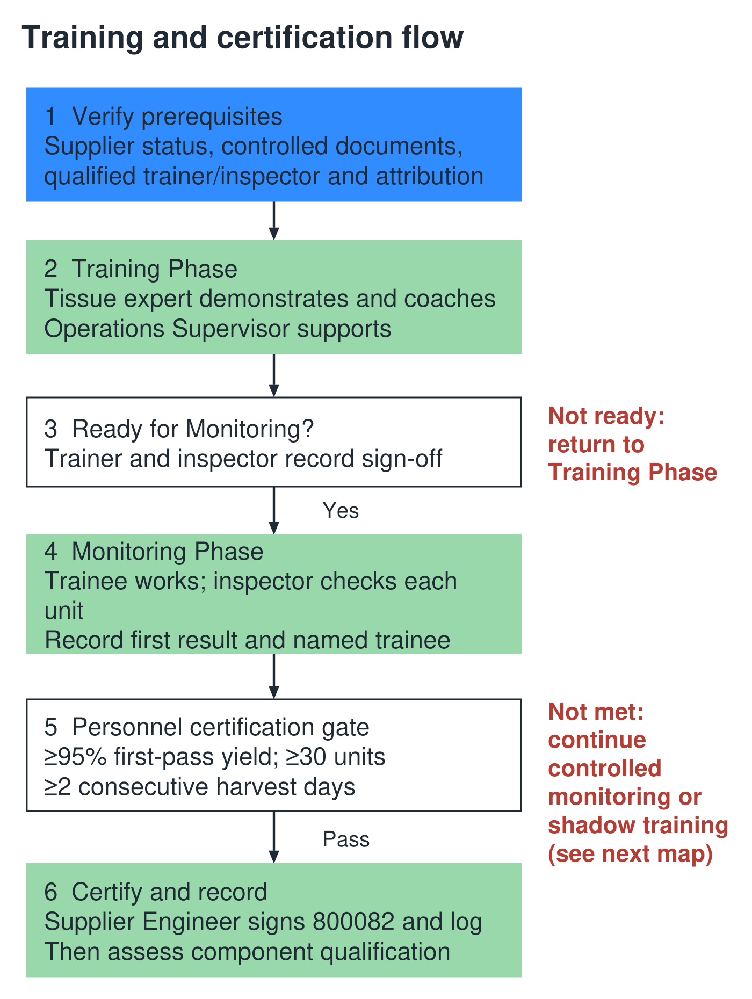
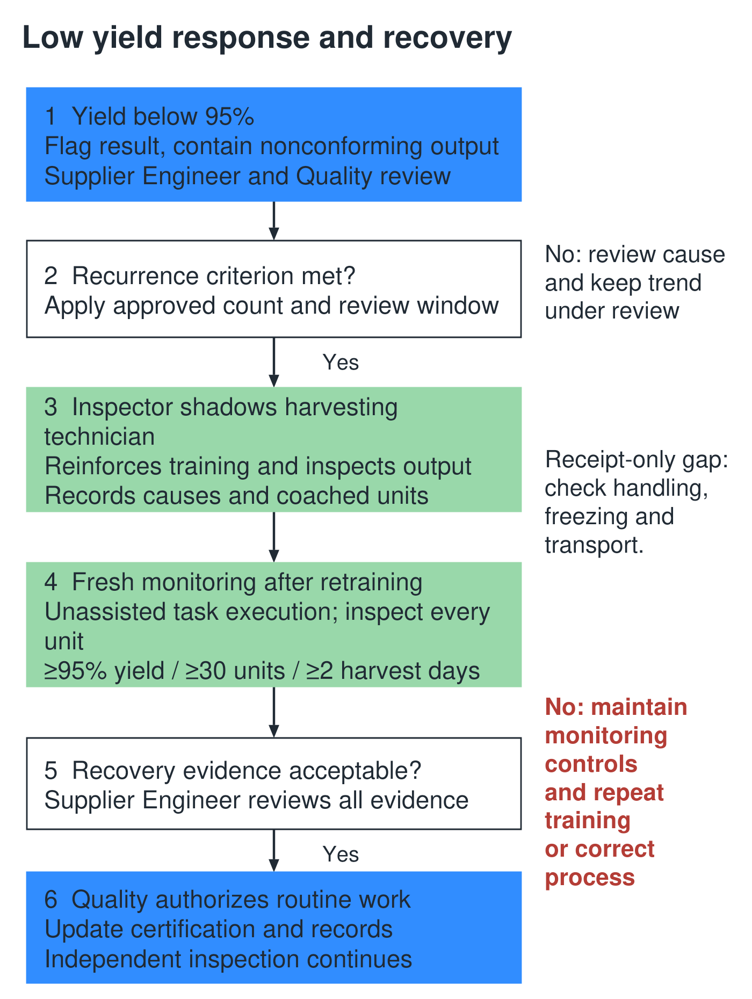

# Tissue Supplier Personnel Training and Certification

Advanced Tissue Models • 668XXX • Standard Operating Procedure • Review draft v2

Owner: Supplier Engineering. Approver: Quality. Technical standard owner: Design Engineer. Effective date and controlled revision: assigned upon approval.

## 1 Purpose and scope

This procedure defines training, monitoring and certification for supplier personnel performing tissue harvest, processing, packaging or build activities. It applies to every tissue family listed in Appendix A. Personnel certification precedes tissue component qualification and does not replace supplier approval or product acceptance.

Entry triggers are a new supplier providing new or existing tissue, an existing supplier providing new tissue, new or reassigned personnel, and retraining caused by changes, technique-related nonconformance or recurring low yield. Non-tissue parts follow the separate Component Qualification procedure. Internal manufacturing training remains under 668729.

## 2 Responsibilities

| Role | Responsibility |
|---|---|
| Supplier Engineering | Own procedure and training log; evaluate individual evidence, certify scope, review trends and coordinate qualification. |
| Quality | Approve procedure and deviations; certify inspectors with the Design Engineer; govern containment and return to routine work. |
| Design Engineer | Own the acceptance standard and process instruction content; resolve borderline criteria; approve defect examples and reference judgments. |
| Tissue expert and site inspector | Expert delivers technique training. Inspector checks output and records attribution. Both sign readiness for Monitoring. |
| Operations Supervisor and supplier site lead | Support training and staffing; enforce personnel status and controls; notify Supplier Engineering before reassignment. |
| Training Department and trainee | Training Department retains training records under 668005, subject to release confirmation. Trainee follows the instruction and participates in monitoring. |

## 3 References and definitions

All existing procedures remain separate. Use their current controlled revisions. The identifiers 668XXX are placeholders requiring document-control assignment.

| Identifier | Document or role in the system |
|---|---|
| 668008 | Supplier Controls, Advanced Tissue Models |
| 668009 | Supplier Selection, Approval and Monitoring, Advanced Tissue Models |
| 668504 / 668529 | Supplier Auditing / Approved Supplier List Use and Maintenance |
| 668007 | Purchasing and Planning |
| 668005 / 668729 | Training / Manufacturing Training and Certification |
| 800082 | Training Record |
| 668XXX | Component Qualification and its checklist, separate from this procedure |
| Appendix A | Approved tissue matrix, process instruction, specification and named personnel |
| To confirm before release | Nonconformance, corrective action and document-change-control procedure identifiers |

### Definitions

SH (Supplier Site) means any tissue supplier location, including a slaughterhouse or processor. IQC (Incoming Quality Control) at the supplier site inspects tissue when harvested or built. ATM (Advanced Tissue Models) incoming inspection independently determines acceptance before assembly. Full role names are used elsewhere for clarity.

A tissue family groups parts sharing an approved process instruction and acceptance specification. Certification applies to a named person, supplier site, task, tissue family and applicable document revisions; it is not blanket certification for all tissue tasks.

First-pass yield equals the number of units conforming at their first inspection divided by all units first inspected in the defined window, multiplied by 100. Rework cannot convert a first-pass failure into a first-pass success. Record coached or demonstration units separately.

The Training Phase permits demonstration and direct coaching. The Monitoring Phase evaluates task execution with every unit inspected. There is no standing Mentor or Certified Supplier Trainer role. Quality and the Design Engineer designate the tissue expert for each site and family.

## 4 Prerequisites and training

### 4.1 Readiness to begin

Supplier Engineering verifies supplier approval under 668008 and 668009 and the Approved Supplier List record under 668529. Before collecting qualification evidence, complete and approve the applicable Appendix A settings, including the acceptance specification, task scope, inspector status and attribution method.

The Design Engineer communicates the acceptance standard to the tissue expert and inspector. They use the controlled instruction, specification and approved defect examples to teach personnel. They must not independently redefine acceptance. Escalate ambiguous criteria to the Design Engineer and record the decision; recurring ambiguity requires a controlled document update.

Set up per-unit attribution before Monitoring. Use a unit identifier, traceable batch log or one-trainee-at-a-time batch method that links every first inspection result to a named person and task. Mixed output without reliable attribution cannot establish individual certification.

### 4.2 Training Phase

The designated tissue expert demonstrates the task and coaches the trainee. The Operations Supervisor assists. Training covers the relevant process steps, acceptable and unacceptable tissue features, defect identification, handling, packaging, labeling, cold-chain handoff and records. Use language and materials the trainee understands.

Record the demonstration count required in Appendix A and each completed demonstration. Include the actual part family and task rather than limiting the procedure to female pelvic harvesting. Direct support and rework guidance are permitted during training and are recorded separately from certification evidence.

The tissue expert and inspector jointly confirm and sign that the trainee can perform the task to the controlled instruction before entering Monitoring. Record the date, person, task, site, tissue family and document revisions. If not ready, continue training.

### 4.3 Authorization boundaries

Personnel perform routine supply work only within their certified scope or the defined Monitoring controls. Instructional work remains supervised and segregated from qualifying evidence. Any work outside these conditions requires the written, time-limited Quality-approved deviation described in Section 7.3. Training status alone never authorizes shipment.

## 5 Monitoring and personnel certification

### 5.1 Monitoring execution

The trainee performs the task and the qualified supplier-site inspector inspects every unit, records its first result, defect classification, suspected cause and individual attribution. Record observed facts separately from inferred causes. Supplier Engineering reviews the complete sequence to distinguish skill, material, process and inspection issues.

Questions to trainers or certified peers are permitted without penalty. If a unit requires direct coaching or hands-on correction, identify it as coached, retain its result and return to training as appropriate. Coached units do not count as unassisted certification evidence. After coached retraining, open a fresh Monitoring window; retain prior results.

### 5.2 Certification gate

For each person, task and tissue family at a site, certification requires at least 95% first-pass yield across at least 30 inspected units over at least two consecutive harvest days. Harvest days are successive days when the in-scope harvest task is performed; non-harvest calendar days do not supply evidence. Record the evaluation window before evaluating the result and retain all units within it; do not select only favorable days or units.

Use the actual inspected denominator and compare the unrounded yield with 95%. With exactly 30 inspected units, 29 passes meet the gate (96.67%); 28 passes do not (93.33%). The minimum is 30 units in total across the window, not 30 per day. This is a personnel screening criterion, not statistical proof of long-term process capability.

### 5.3 Failure and certification decision

A trainee who has not met every gate remains under Monitoring controls or returns to training. The inspector flags every result below 95% for Supplier Engineering and Quality review. Recurring results below 95%, using the approved recurrence count and window, require the inspector to shadow the harvesting technician, reinforce training and inspect the output. Apply Section 7 for containment and recovery.

Supplier Engineering evaluates and signs the evidence, records certification on FORM 800082 and updates the Supplier Training Log with scope and status. No family may use a lower yield threshold merely because 95% has not yet been achieved. Correct the technique or process and reassess under the same threshold.

## 6 Inspector certification and component qualification

### 6.1 Inspector competency

Advanced Tissue Models Quality and the Design Engineer train and certify supplier-site inspection personnel. Harvest yield does not measure inspection accuracy. An uncertified inspector cannot provide the sole qualifying judgments used to certify harvesting personnel.

Use a Quality-approved attribute-agreement assessment against Design Engineer-confirmed reference judgments. For perishable tissue, the proposed method is concurrent independent inspection of the same live units, supported by an approved image set for defect classification. Preserve blinding until each inspector records a judgment. Include passes, fails and borderline cases.

Before use, Quality and the Design Engineer approve the reference-set size and mix, agreement and defect-classification thresholds, false-accept and false-reject limits, critical-nonconformance rule, repeatability requirement and reassessment triggers. The original proposed 90% agreement threshold is not approved by this draft. Record competency in explaining defects and escalating uncertain causes.

### 6.2 Separate tissue component gate

After personnel certification, execute the approved tissue component qualification plan at the supplier site. Every required qualification lot must achieve at least 95% first-pass yield. Supplier Engineering and Quality must approve the number of lots, lot definition and inspection coverage before execution. The 30-unit personnel minimum does not establish the lot count or lot inspection sample.

Link lot results to certified personnel, site, part, process and specification revisions. Complete the tissue section of the Component Qualification Checklist; obtain Quality approval before recording the qualified supplier-site and part scope under 668529 and handing off to 668007 Purchasing and Planning. A failed lot requires containment, investigation and an approved repeat plan; it cannot be hidden by averaging it with passing lots.

### 6.3 Independent product acceptance

Only conforming units may move downstream under the applicable disposition controls. A 95% yield does not permit release of the failed 5%. Supplier-site inspections support training and qualification; every tissue unit remains subject to the independent incoming/pre-assembly inspection required at Advanced Tissue Models, regardless of personnel certification.

Compare supplier-site and receipt results. A receipt-only deterioration requires investigation of freezing, handling, transport and inspection consistency. Do not attribute it to harvesting personnel or order retraining solely from the yield difference. New personnel alone require individual certification; assess whether any accompanying process change requires part requalification.

## 7 Ongoing control and records

### 7.1 Triggers and review

Supplier Engineering reviews yield and defect trends by person, task, family and site and shares findings with Quality. Monthly supplier quality and supply-chain calls track effectiveness, staffing and actions. Do not delay containment or low-yield review until the monthly call.

New or reassigned personnel enter training. Specification or process-instruction changes require documented training on the change; Quality and the Design Engineer determine the need for Monitoring and component requalification. Technique-related nonconformance or corrective action requires retraining and Monitoring. Apply the approved inactivity interval to reassess lapsed competency.

### 7.2 Recurring yield below 95 percent

Segregate nonconforming output and review affected lots under the existing disposition process. When the approved recurrence rule is met, the supplier-site incoming quality control inspector shadows the harvesting technician, reinforces the approved technique and inspects output. Record the observations, coached units, defects and suspected causes. Investigate material, method and inspection causes alongside personnel skill.

After corrective training, obtain a fresh unassisted Monitoring window meeting 95% yield, 30 inspected units and two consecutive harvest days. Supplier Engineering reviews recovery evidence and Quality authorizes return to routine work, with the status and authorization recorded. If the gate is not met, maintain controls, repeat training or correct the process and assess component requalification.

### 7.3 Written exception controls

Before work outside certification or defined Monitoring controls, Quality must approve a documented deviation naming the people, site, tissue and tasks, reason, risk controls, supervision, inspection coverage, quantity or lot limits, start and expiration dates, responsible owner and exit criteria. Supplier Engineering records and tracks the authorization. No verbal or expired deviation permits continued work. Renewals require new approval before expiry.

A deviation does not itself certify a person, qualify a component, lower the 95% criterion or release nonconforming tissue. Product disposition and shipment approval remain separate. When no valid personnel route or deviation exists, stop the affected in-scope supply work and escalate to Quality.

### 7.4 Records

Retain FORM 800082 and linked evidence under 668005. Supplier Engineering owns the status log; confirm the Training Department filing responsibility and approved repository before release. Keep unit attribution, first results, yields, training language, readiness signatures, inspector assessments, deviations, revisions and recovery decisions. Link component evidence to its checklist and retain records for audits under 668504. The repository and retention period follow controlled requirements, not an assumed software platform.

## 8 Training process map

Roles and decisions are shown in the sequence below. The complete text requirements remain controlling. Blue identifies prerequisites; green identifies the training procedure.

## 9 Low yield response process map

The shadow-training path does not replace containment or independent product acceptance. Recovery requires documented evidence and authorization.

## Appendix A Tissue family approval record

Complete one controlled record per tissue family and site. Supplier Engineering coordinates completion; Quality approves the plan with the Design Engineer for technical criteria. Blank required fields prevent execution of the affected qualification activity.

| Field | Required entry or fixed requirement |
|---|---|
| Family, site and tasks | ____________________________ |
| Parts and revisions | ____________________________ |
| Controlled process instruction | Document and revision: ____________________ |
| Acceptance standard and defect catalog | Document and revision; Design Engineer approval: ____________________ |
| Designated expert and inspector | Names, competency record, designation date: ____________________ |
| Training language and demonstrations | Language, materials and minimum demonstrations: ____________________ |
| Attribution method | Approved method demonstrated before Monitoring: ____________________ |
| Personnel gate | At least 95% yield; at least 30 inspected units; at least two consecutive harvest days |
| Monitoring window and attempt limit | Window definition and escalation limit: ____________________ |
| Recurring low yield | Count of results below 95% and review window: ____________________ |
| Qualification lots | Number, definition and inspection coverage: ____________________
Every required lot at least 95% first-pass yield |
| Inspector assessment | Reference set, agreement criteria, error limits and repeatability: ____________________ |
| Inactivity and receipt gap | Approved reassessment interval and investigation trigger: ____________________ |
| Approvals | Supplier Engineering / Quality / Design Engineer with dates: ____________________ |

Pelvic block starting references requiring verification: process instruction 1176680; candidate parts 666541, 666540, 666518 and 666506. Confirm whether 668741 is the controlling acceptance specification and confirm its current revision. The original draft labeled 666541 and 666506 as specifications/work instructions; do not treat those identifiers as validated specification references.

## Appendix B Evidence and release checklist

### Monitoring evidence record

Header: supplier site, tissue family, part and revision, trainee, task, trainer, inspector, instruction/specification revisions, window start/end and readiness signatures.

| Per-unit field | Required information |
|---|---|
| Traceability | Unit identifier, lot, harvest date and person/task attribution |
| First inspection | First pass or fail, defect class, inspector and timestamp |
| Training support | Unassisted, question only or coached; coaching details |
| Disposition | Segregation, rework or disposition reference; original result retained |

Window summary: inspected count, first-pass count, unrounded yield, consecutive harvest days, excluded coached units with reasons, gate decision, Supplier Engineering signature/date and FORM 800082 reference. Retain failed attempts and link subsequent recovery windows.

### Controlled release checklist

| Item | Approval needed |
|---|---|
| Assigned document identifiers and revisions | Document control; maintain 668008 and 668009 separately |
| Tissue matrix and acceptance standard | Quality and Design Engineer |
| Qualification-lot count and inspection plan | Supplier Engineering and Quality |
| Recurrence window, attempt and inactivity limits | Supplier Engineering and Quality |
| Inspector criteria and reference set | Quality and Design Engineer |
| Attribution method and implementation | Supplier Engineering and site inspector |
| Repository, retention and filing responsibility | Training Department and Quality |
| Corporate applicability and change triggers | Component Qualification owner with Quality |

The three green notes cropped from the original proposed map remain unresolved source material. Their missing text must be recovered before it is relied on for qualification or change-trigger requirements. This review draft does not retire any existing document or establish a controlled effective date.
